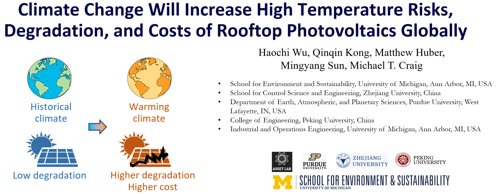

# SolarPVDegradationClimateChange

This is the Code repository for publication on accelerating degradation of rooftop solar photovoltaics under climate change.

Key contributors: Haochi Wu, Michael Craig at the University of Michigan, & Qinqin Kong at Purdue Univerisity.

Updated 7/23/2024 HW

## Python Environment
The python environment is deployed in Linux and pipeline managed using slurm computing cluster platform at Rosen Center for Advanced Computing at Purdue University and Advanced Research Computing at the University of Michigan.

The code contains core process of the research, including:
- **01_slurm_command.py**    
    - Slurm command script for submitting batch jobs.
      
- **01_Slurm_PVTemp_Vectorized_Calculation_CMIP6_GCMs.py**    
    - Python script for vectorized calculation of PV temperature using CMIP6 GCMs data.
    - Accompanied by `01_Slurm_PVTemp_Vectorized_Calculation_CMIP6_GCMs.sbat` for Slurm job submission.
      
- **02_slurm_command.py**    
    - Second Slurm command script for batch jobs.
      
- **02_Slurm_PVTemp_Vectorized_Calculation_ERA5.py**    
    - Python script for vectorized calculation of PV temperature using ERA5 data.
    - Accompanied by `02_Slurm_PVTemp_Vectorized_Calculation_ERA5.sbat` for Slurm job submission.
      
- **03_slurm_command.py**    
    - Third Slurm command script for batch jobs.
      
- **03_Slurm_T98_Calculation_ERA5.py**    
    - Python script for T98 temperature calculation using ERA5 data.
    - Accompanied by `03_Slurm_T98_Calculation_ERA5.sbat` for Slurm job submission.
      
- **04_Create_Climatology_and_Abnormal_Signal_CMIP6_GCM.py**    
    - Script to create climatology and identify abnormal signals using CMIP6 GCM data.
      
- **05_Add_Abnormal_Signal_to_ERA5.py**    
    - Script to add identified abnormal signals to ERA5 data.
      
- **06_Plot_T98_for_ERA5_add_CMIP6_GCMs.py**    
    - Script for plotting T98 temperatures combining ERA5 and CMIP6 GCMs data.
      
- **07_calculate_LCOE_Changes.py**    
    - Script to calculate changes in Levelized Cost of Electricity (LCOE).
      
- **tas_abnormal_from_qin.csv**    
    - CSV file containing abnormal temperature data for 20 CMIP6 GCMs.

And more relevant script and visualization script is coming soon.

## Data Availability
CMIP6 GCMs temperature and energy generation dataset: https://transfer.rcac.purdue.edu/file-manager?origin_id=e7eecae4-ab46-4016-b8f8-ba0379421b0b&origin_path=%2F
 
CMIP6 temperature dataset downsacled and bias-corrected by ERA5 dataset: https://transfer.rcac.purdue.edu/file-manager?origin_id=64916c8c-1c24-4716-ba90-a06fc412e778&origin_path=%2F

The dataset for future rooftop PV temperature is about **130 Terabytes (TB)** in size and is freely available at Purdue Fortress long-term archive, accessible via Globus:

Users can log into Globus ([https://www.globus.org](https://www.globus.org)) using their Globus ID, Gmail, GitHub handle, ORCID ID, or institutional account. 

Upon login, the dataset can be accessed by searching the following universally unique identifiers (UUIDs): "e7eecae4-ab46-4016-b8f8-ba0379421b0b" for the CMIP6 GCMs temperature and energy generation dataset, and "64916c8c-1c24-4716-ba90-a06fc412e778" for the CMIP6 temperature dataset downsacled and bias-corrected by ERA5 dataset. 

For review purposes, reviewers can log into Globus with the following credentials: Globus ID "scientificdatareviewer2024@globusid.org" and password "review2024".

Additional related varibales after same bias correction process(i.e. Energy Output, Air Temperature, Relative Humidity) are not here due to size and extra effort to upload.

## Data Description
### Rooftop PV under CMIP6 GCMs Climate Data:
The file size for the CMIP6 GCMs temperature raw series and energy generation series ranges from 0.3GB to 1.5GB per file. We have stored data for the years 1950 to 2100, covering 150 years for 20 different GCMs.
total of 150 * 20 = 3,080 years of data.

### Rooftop PV under CMIP6 GCMs Climate with ERA5 Bias-Corrected Data:
The size of the temperature files for CMIP6 after bias correction is approximately 33GB. This dataset includes hourly temperature data for 27 ERA5 sample years, 20 GCM models, and 7 warming targets, resulting in a total of 7 * 20 * 27 = 3,780 years of data.

### Derived 98 quantile temperature (T98) Data:
Based on above dataset, we have calculated the typical T98 temperature. The global map data is provided at a resolution of 0.25° * 0.25°, with a file size of approximately 7MB. with total of 7 * 20 * 27 = 3,780 years of data.

### the 20 CMIP6 GCMs are listed below:

| Index | Model Name              |
|-------|-------------------------|
| 1     | ACCESS-CM2              |
| 2     | BCC-CSM2-MR             |
| 3     | CanESM5                 |
| 4     | CMCC-CM2-SR5            |
| 5     | CMCC-ESM2               |
| 6     | CNRM-CM6-1              |
| 7     | EC-Earth3_r1i1p1f1      |
| 8     | EC-Earth3_r3i1p1f1      |
| 9     | EC-Earth3_r4i1p1f1      |
| 10    | GFDL-ESM4               |
| 11    | HadGEM3-GC31-LL         |
| 12    | HadGEM3-GC31-MM         |
| 13    | KACE-1-0-G              |
| 14    | KIOST-ESM               |
| 15    | MIROC-ES2L              |
| 16    | MIROC6                  |
| 17    | MPI-ESM1-2-HR_r1i1p1f1  |
| 18    | MPI-ESM1-2-HR_r2i1p1f1  |
| 19    | MPI-ESM1-2-LR           |
| 20    | MRI-ESM2-0              |
